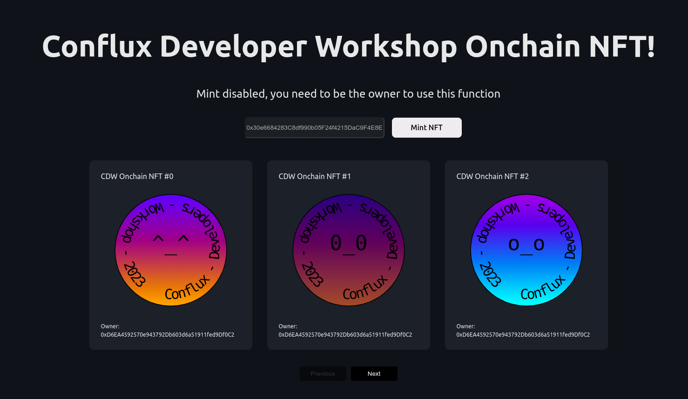
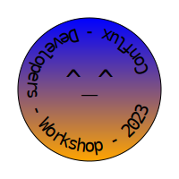
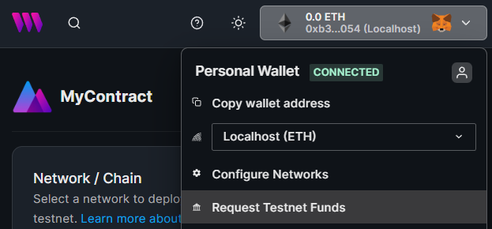
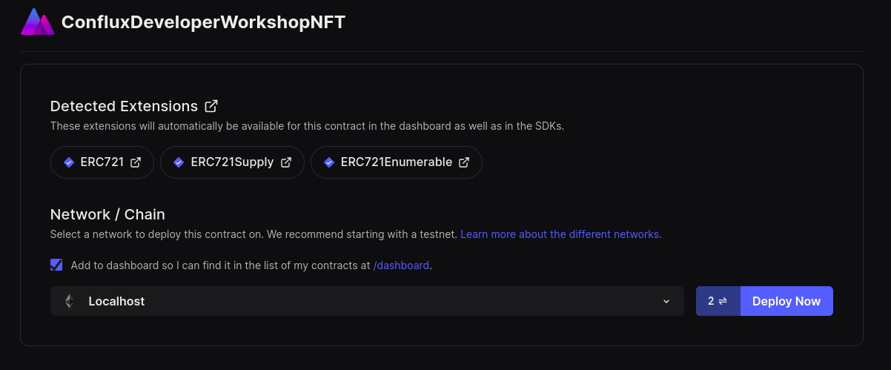
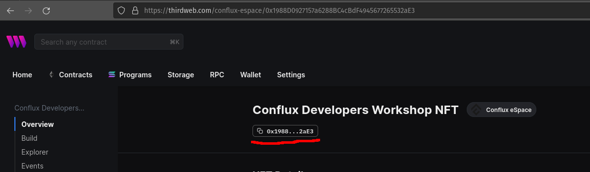
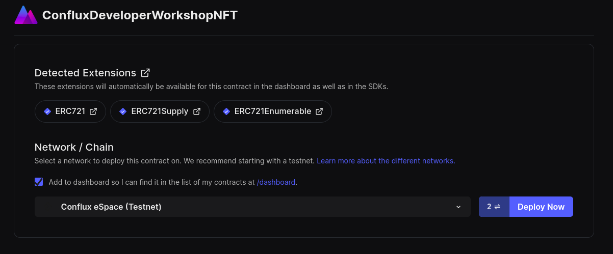
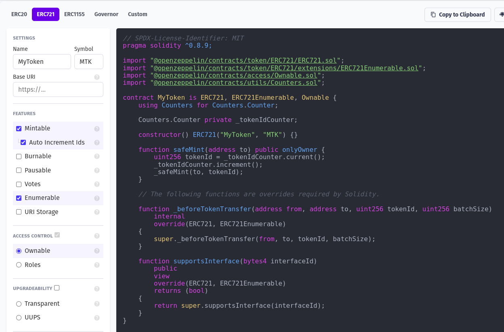

# ConfluxDeveloperWorkshopNFT

## Project Introduction

Welcome to the Conflux Developers Workshop (CDW) NFT Mint Page!

This project serves as a submission for the Conflux Developers Workshop, showcasing a simple NFT minting page. It leverages the Thirdweb SDK for React, OpenZeppelin contracts, and Hardhat to provide a complete example how to use these technologies for minting and showcasing NFTs.


### Features

- The NFT minting page allows the contract owner to mint one of the 100 available NFTs to their own address or another specified address when the mint button is pressed.

- The generated NFT are visible are paginated at the bottom of the page with the owner information and their description.

- The application is hosted on 4everland and can be accessed through the following link: [CDW NFT](http://cdw.4everland.app).

- The deployed contract can be found [here](https://evm.confluxscan.io/address/0x1988d0927157a6288bc4cbdf4945677265532ae3)


### Web Interface
Take a look at the web interface below, which provides a user-friendly experience for minting NFTs:




### On-Chain SVG Generation
When querying the token URI of the ERC721 contract, the smart contract dynamically generates SVG images. All the necessary data for generating the images is stored on the blockchain. Below is an example of the NFT generated:




The generated NFTs possess three distinct attributes: color1 and color2 define the gradient used, and face represents an ASCII emoji located at the center.

We hope you enjoy exploring this project and find it useful for understanding NFT minting and on-chain SVG generation.

## Setup

The project is an example for [Thirdweb React SDK](https://portal.thirdweb.com/react) to interact with smart contracts deployed to a
[local Hardhat node](https://hardhat.org/hardhat-runner/docs/guides/deploying).

The code is split into two directories:

1. `contracts`: Contains the smart contracts and the scripts to deploy to a local node.
2. `application`: Contains the React application that interacts with the smart contracts.

Install the dependencies for the project, in both the `contracts` and `application` directories.

```bash
cd application
npm install

cd ../contracts
npm install
```

### Running a local node

Use the `hardhat` CLI to [run a local node](https://hardhat.org/hardhat-runner/docs/getting-started#connecting-a-wallet-or-dapp-to-hardhat-network).

```bash
# From within the /contracts directory
npx hardhat node
```

### Deploy the smart contracts locally

Use the [CLI](https://portal.thirdweb.com/cli) to deploy the smart contracts to the local node via the [dashboard](https://portal.thirdweb.com/dashboard).

```bash
# From within the /contracts directory
npx thirdweb deploy
```

This command compiles your contract and produces a link to the [dashboard](https://portal.thirdweb.com/dashboard) where you can deploy the contract to a local node.

Use the `Request testnet funds` button to load your wallet with some funds to deploy the contract.



Ensure to select the `Localhost` network and click on the `Deploy` button!



Once deployed, copy your contract address from the dashboard:



Paste it in the `application/config/parameters.tsx` file, as value of the `contractAddress` constant at line 6.

```jsx
// Your contract address here!
export const contractAddress:string = "0x...";

```

Execute a development instance of the application with:

```bash
cd application
npm run dev
```
The console will show the url to reach the development instance, normally is https://localhost:3000


### Deploy the smart contracts on Conflux Espace

Use the [CLI](https://portal.thirdweb.com/cli) to deploy the smart contracts to the local node via the [dashboard](https://portal.thirdweb.com/dashboard).

```bash
# From within the /contracts directory
npx thirdweb deploy
```

This command compiles your contract and produces a link to the [dashboard](https://portal.thirdweb.com/dashboard) where you can deploy the contract to all supported chain included eSpace and eSpace testnet.

Be sure to have enough CFX your wallet with to deploy the contract.

Ensure to select the `Conflux eSpace testnet` or `Conflux eSpace` network and click on the `Deploy` button!



Once deployed, copy your contract address from the dashboard:


Paste it in the `application/config/parameters.tsx` file, as value of the `contractAddress` constant at line 6.

```jsx
// Your contract address here!
export const contractAddress:string = "0x...";

```
In the same file amend the `chain` constant

```jsx
// Your contract address here!
export const chain:Chain = ConfluxEspaceTestnet;

```

Execute a development instance of the application with:

```bash
cd application
npm run dev
```
The console will show the url to reach the development instance, normally is https://localhost:3000

## Smartcontract

The base of the smartcontract has been created with [OpenZeppeling wizard ](https://wizard.openzeppelin.com/#erc721) 
is a ERC721 with Mintable, Enumerable and autoincrement flags as per image below:



These flags are enough to be compatible with most of the function Thirdweb sdk and dashboard offers, If you want a smart contract fully compatible with Thirdweb you can use their onchain example that can be found here: [Thirdweb OnChain NFT](https://github.com/thirdweb-example/on-chain-nft-metadata/blob/main/contracts/Contract.sol)

### Test results

- Coverage
```shell
Version
=======
> solidity-coverage: v0.8.3

Instrumenting for coverage...
=============================

> CDWMint.sol

Compilation:
============

Nothing to compile

Network Info
============
> HardhatEVM: v2.16.0
> network:    hardhat


  ConfluxDevelopersWorkshopNFT
    ✔ should deploy the contract correctly
    ✔ should mint a new token (246ms)
    ✔ should return a valid token URI (206ms)
    ✔ should only allow the owner to mint tokens
    ✔ should generate unique token URIs (399ms)
    ✔ should revert when minting more than the maximum supply (983ms)
    ✔ should emit a Transfer event when minting a new token
    ✔ should return the total supply of tokens (49ms)
    ✔ should return the correct owner of a token
    ✔ should return the correct token URI (195ms)
    ✔ should revert when querying token URI for a nonexistent token
    ✔ should allow the owner to transfer a token
    ✔ should revert when a non-owner tries to transfer a token
    ✔ should return the correct token balance for an address
    ✔ should return the correct token by index
    ✔ should revert when querying token by index for an invalid index
    ✔ should support the ERC721Enumerable interface
    ✔ should support the ERC721 interface


  18 passing (5s)

--------------|----------|----------|----------|----------|----------------|
File          |  % Stmts | % Branch |  % Funcs |  % Lines |Uncovered Lines |
--------------|----------|----------|----------|----------|----------------|
 contracts/   |      100 |      100 |      100 |      100 |                |
  CDWMint.sol |      100 |      100 |      100 |      100 |                |
--------------|----------|----------|----------|----------|----------------|
All files     |      100 |      100 |      100 |      100 |                |
--------------|----------|----------|----------|----------|----------------|
```

- Gas Report

```shell
·-------------------------------------------------|---------------------------|-------------|-----------------------------·
|              Solc version: 0.8.18               ·  Optimizer enabled: true  ·  Runs: 200  ·  Block limit: 30000000 gas  │
··················································|···························|·············|······························
|  Methods                                                                                                                │
·································|················|·············|·············|·············|···············|··············
|  Contract                      ·  Method        ·  Min        ·  Max        ·  Avg        ·  # calls      ·  usd (avg)  │
·································|················|·············|·············|·············|···············|··············
|  ConfluxDevelopersWorkshopNFT  ·  safeMint      ·     149969  ·     161169  ·     159792  ·          122  ·          -  │
·································|················|·············|·············|·············|···············|··············
|  ConfluxDevelopersWorkshopNFT  ·  transferFrom  ·          -  ·          -  ·      63455  ·            1  ·          -  │
·································|················|·············|·············|·············|···············|··············
|  Deployments                                    ·                                         ·  % of limit   ·             │
··················································|·············|·············|·············|···············|··············
|  ConfluxDevelopersWorkshopNFT                   ·          -  ·          -  ·    2972404  ·        9.9 %  ·          -  │
·-------------------------------------------------|-------------|-------------|-------------|---------------|-------------·
```


For the frontend application the test suite has been setup and configured to be compatible with NEXTJS/Typescript, but the documentation related to the Thirdweb SDK testing or in general for web3/etherjs is vey fragments, so only a POC of a base testing has been created due to the ifficulty to mock the Thirdweb components.

 PASS  pages/index.test.tsx
  Home page
    ✓ renders Connect Wallet correctly (257 ms)

Test Suites: 1 passed, 1 total
Tests:       1 passed, 1 total
Snapshots:   0 total
Time:        2.125 s
Ran all test suites related to changed files.